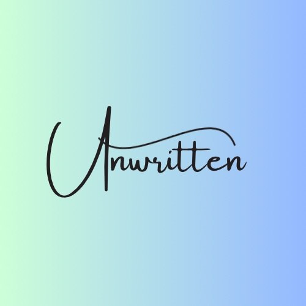

<!-- PROJECT LOGO -->

<!-- Put the link to the repository here -->
  

<!-- TABLE OF CONTENTS -->

  
Table of Contents

  <ol>
    <li>
      <a href="#about-the-project">About The Project</a>
      <ul>
        <li><a href="#built-with">Built With</a></li>
      </ul>
    </li>
    <li>
      <a href="#getting-started">Getting Started</a>
      <ul>
        <li><a href="#installation">Installation</a></li>
      </ul>
    </li>
    <li><a href="#usage">Usage</a></li>
    <li><a href="#roadmap">Roadmap</a></li>
    <li><a href="#contributing">Contributing</a></li>
    <li><a href="#contact">Contact</a></li>
    <li><a href="#acknowledgments">Acknowledgments</a></li>
  </ol>

<!-- ABOUT THE PROJECT -->

## About The Project

This project was built using Webpack, Babel, and CodeMirror to create a progressive web app text editor themed around cats

### Built With

<!-- GETTING STARTED -->

## Getting Started

This app is fully functional and live at:
<!-- Insert deployed app here -->

If you would like to run the app locally, follow the below installation instructions

### Installation

Clone the repository

git clone https://github.com/Uwttn/code-editor.git

## Roadmap

#### MVP

- [x] Starter Code added
- [x] indexDB functionality
- [x] Webpack functionality
- [x] Service Worker functionality
- [x] manifest.json created w/ npm run build
- [x] Install button functionality
- [x] Deployed

#### Future Development

<!-- CONTRIBUTING -->

## Contributing

Want to improve this project? Great! We encourage contribution to make this project even better. Here are some ways you can contribute:
- Report Bugs: If you find any issues, please report them.
- Suggest feautures: Do you have an idea for a new feature? Share it with us!
- Contribute code: If you have programming skills, feel free to contribute code to the project.
- Provide feedback: Your feedback on the project is valuable. Let us know what you think!

<!-- CONTACT -->

## Contact

- Jose's [Portfolio](https://uwttn.github.io/portfolio/)
- GitHub: [uwttn](https://github.com/uwttn)
- LinkedIn: [uwttn](https://www.linkedin.com/in/uwttn)
- Email: muchati@icloud.com

<!-- ACKNOWLEDGMENTS -->

## Acknowledgments

I would like to acknowledge Mary Elenius [@404pandas](https://github.com/404pandas) for providing the starter code.
